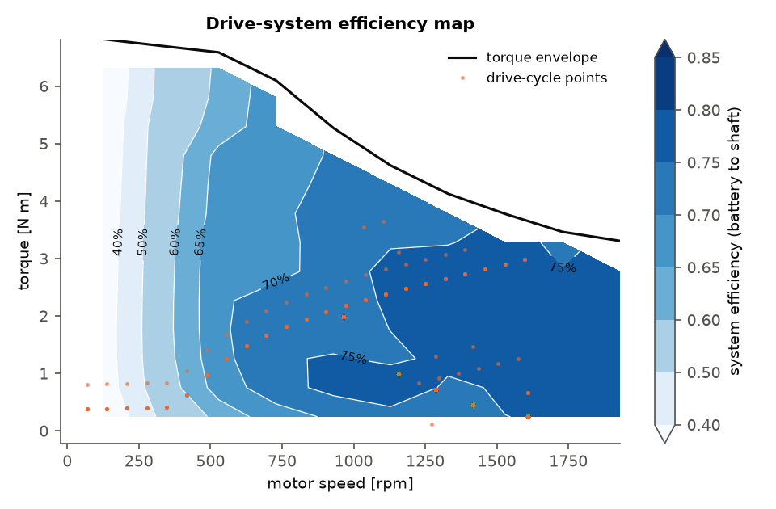

# Analysis and Design Considerations for a Switched Reluctance Motor-based Drive System for an Electric Bike

This repository contains a design study and a reproducible Python toolchain for a
**250 W pedelec drive built around a 12/8, 3-phase switched reluctance motor
(SRM)**. The SRM drives the wheel through a planetary hub gear and is fed from a
36 V Li-ion battery through an asymmetric half-bridge converter.

The full write-up is in **[`docs/design_report.md`](docs/design_report.md)**.
The tables it quotes are regenerated into [`results/results.md`](results/results.md)
along with the figures.

An IEEE Transactions-format manuscript (IEEEtran, journal mode) is in
**[`paper/`](paper/)**. It is revised after peer review and its results are
FE-based. [`paper/main.pdf`](paper/main.pdf) is the manuscript, and
[`paper/response_to_reviewers.pdf`](paper/response_to_reviewers.pdf) is the
first-round reply and
[`paper/response_to_reviewers_round2.pdf`](paper/response_to_reviewers_round2.pdf)
the second-round reply. The first manuscript version is kept as `paper/main_v1.tex`.



## What the toolchain does

| Step | Module | Content |
|---|---|---|
| Vehicle mission | `srm_ebike/vehicle.py` | Road-load model (rolling, aero, grade, inertia) and motor torque/speed requirements, including the corner-speed choice |
| Topology & sizing | `srm_ebike/geometry.py` | Pole-number comparison, output equation, Lawrenson pole-arc rules, pole/yoke dimensions, turns from volt-seconds, slot fill, resistance, aligned/unaligned inductance |
| Magnetics | `srm_ebike/magnetics.py` | Nonlinear ψ(i, θ) with saturation, closed-form co-energy and torque |
| Drive simulation | `srm_ebike/drive.py` | Asymmetric half bridge (magnetise / freewheel / demagnetise) with device drops, hysteresis soft chopping, single-pulse operation, phase-shifted torque summation |
| Losses | `srm_ebike/losses.py` | Copper, iron (Bertotti, non-sinusoidal factor), MOSFET conduction/switching, mechanical |
| Control & performance | `srm_ebike/performance.py` | Turn-on/turn-off angle optimisation, torque–speed envelope, minimum-loss operating points, efficiency map |
| Design flow | `srm_ebike/design_flow.py` | End-to-end design, converter ratings (devices, DC-link capacitor), thermal check |
| Route | `srm_ebike/drive_cycle.py` | Pedelec ride over a hilly urban route: rider power + motor assist, battery Wh/km, range, braking energy |
| 2-D FEA | `srm_ebike/fea.py` | Nonlinear magnetostatic FE solver: gmsh mesh, scikit-fem Newton iteration with the M270-35A B–H curve, Arkkio torque, coil flux linkage + end-winding term |
| FE-based magnetics | `srm_ebike/magnetics_fea.py` | Energy-consistent ψ(i, θ) model from FE tables; drop-in replacement for the analytical model |
| Torque sharing | `srm_ebike/tsf.py` | Linear / cubic / cosine / exponential TSF, inverse torque map, three-level current tracking |
| Thermal | `srm_ebike/thermal.py` | Four-node transient thermal network (winding, stator, rotor, shell) |
| DC link | `srm_ebike/dclink.py` | Charge bound and harmonic current sharing between capacitor and battery |
| Battery & missions | `srm_ebike/drive_cycle.py` | Flat / hilly / aggressive missions; battery equivalent circuit (OCV(SOC), R_int, sag) with voltage-interpolated drive maps; range to cut-off |
| PM benchmark | `srm_ebike/pm_benchmark.py` | First-order analytic surface-PM machine (12s/10p) at equal envelope, voltage, devices and loss coefficients |

## Quick start

```bash
pip install -r requirements.txt
python -m pytest                       # 31 physics / consistency tests
python scripts/run_analysis.py         # analytical-model analysis -> results/  (~4 min)
python scripts/run_analysis.py --quick --out /tmp/srm   # coarse smoke run (~40 s)

# paper pipeline (order matters: the revision step overwrites the drive figures with FE-based ones)
python scripts/run_fea.py              # FE tables + mutual/air-gap/pole-arc/mesh studies -> results/fea/ (~10 min on 4 cores)
python scripts/make_paper_figures.py   # geometry, trade study, analytical figures -> paper/figures/
python scripts/run_revision.py         # FE-based drive results, TSF, PWM, thermal, gear, DC link -> results/revision/
python scripts/run_revision2.py        # battery voltage/SOC, iron-loss uncertainty, coupled 3-phase FE,
                                       # corner-rule test, PM benchmark -> results/revision2/ (~10 min)
make -C paper                          # builds paper/main.pdf and the response letters
```

The FE solver needs `gmsh` and `scikit-fem` (in `requirements.txt`). On a
headless Linux machine gmsh also needs `libglu1-mesa`.

### Reproducibility

The results in the paper were produced with the exact versions in
[`requirements-lock.txt`](requirements-lock.txt) (Python 3.11.15, NumPy 2.4.6,
SciPy 1.17.1, Matplotlib 3.11.2, scikit-fem 12.0.2, gmsh 4.15.2, TeX Live 2023).
The paper cites commit `e7919ad` (code and data state of the second revision), and [`CITATION.cff`](CITATION.cff)
gives the citation metadata. All intermediate data (FE tables in
`results/fea/`, study outputs in `results/revision*/`) are committed, so the
figures can be rebuilt without re-running the FE campaign.

Every design parameter is a dataclass field (`EBikeSpec`, `SizingInputs`,
`SRMDrive`, `ConverterParams`, `IronLossCoefficients`), so you can run trade
studies from a few lines of Python:

```python
from srm_ebike.design_flow import design_drive
from srm_ebike.vehicle import EBikeSpec

dd = design_drive(EBikeSpec(gear_ratio=11), elec_loading_peak=40e3, air_gap=0.25e-3)
print(dd.design.summary(), dd.drive.i_max)
```

## Baseline result at a glance

| | |
|---|---|
| Machine | 12/8 SRM, Ø135 mm × 36 mm stack, 0.3 mm air gap, 41 turns/pole, ≈3.4 kg active mass |
| Gear | 8 : 1 planetary; 25 km/h = 1608 rpm |
| Torque | 5.93 N·m launch requirement (8 % grade, 0.5 m/s²) met at 26.5 A (FE); 29.2 A limit gives an 11.6 % margin |
| Converter | 3 × asymmetric half bridge, 100 V MOSFETs, 1–2.2 mF DC link rated ≥ 14 A RMS |
| Efficiency (FE-based) | 80.2 % motor and 77.9 % battery-to-shaft at the 250 W rated point |
| Route (FE-based) | 5.1 Wh/km on a hilly 6.4 km route; estimated range ≈ 63 km under the model assumptions |
| Torque ripple | 60–100 % with current-reference control; 10–33 % with cubic TSF below 500 rpm |
| Missions (FE-based) | flat / hilly / aggressive: 2.5 / 5.1 / 10.9 Wh/km |
| PM benchmark | equal-envelope analytic SPM: ≈ 12 points higher rated efficiency; SRM uses 18 % less energy on flat light-assist riding and needs no magnets |

These are predictions from analytical, 2-D FE and lumped models. No prototype
has been measured yet. The model limitations are listed in section X-D of the
paper.
