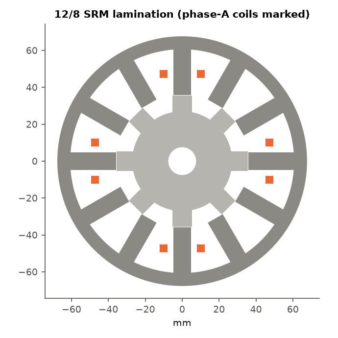
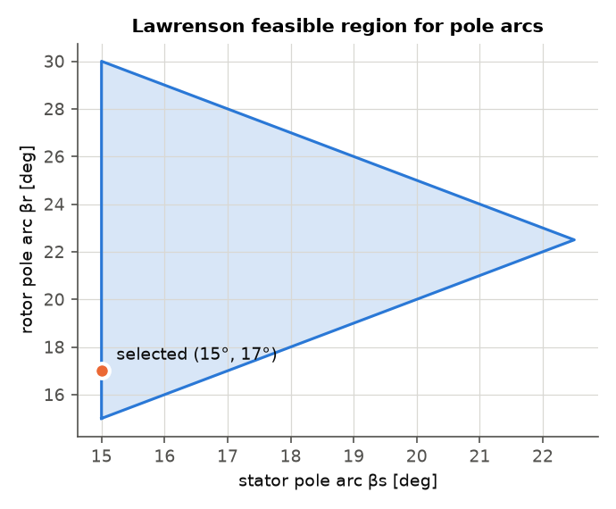
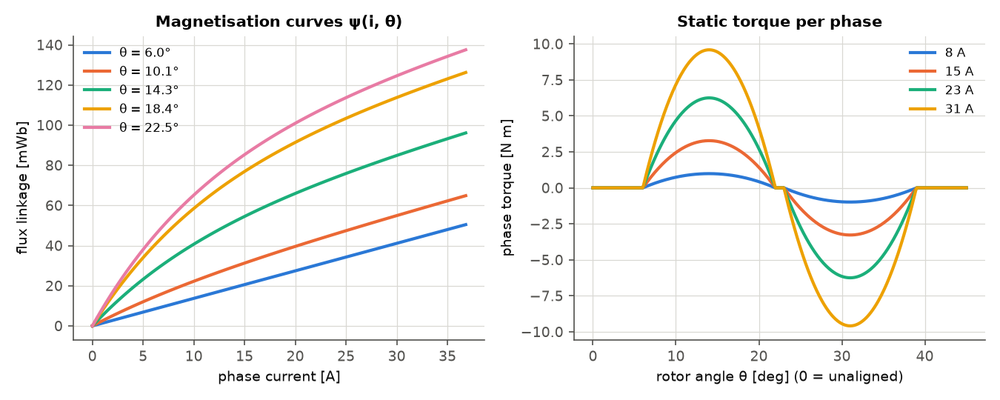
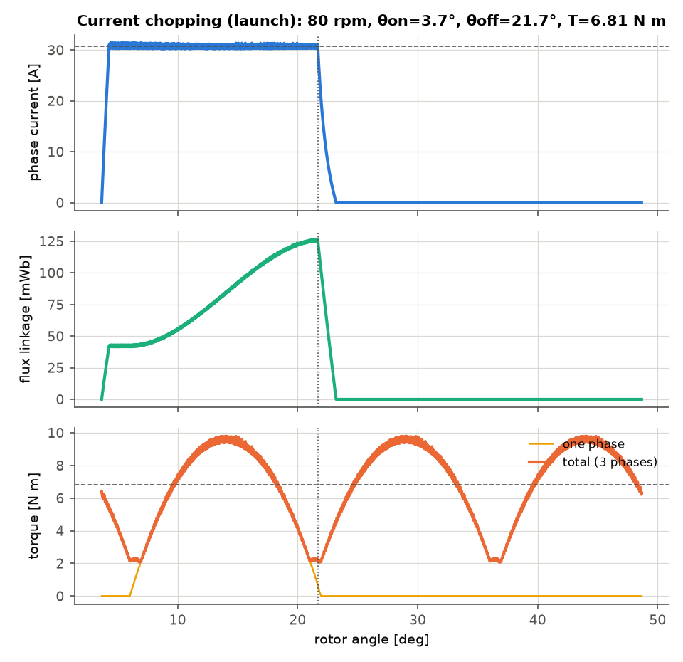
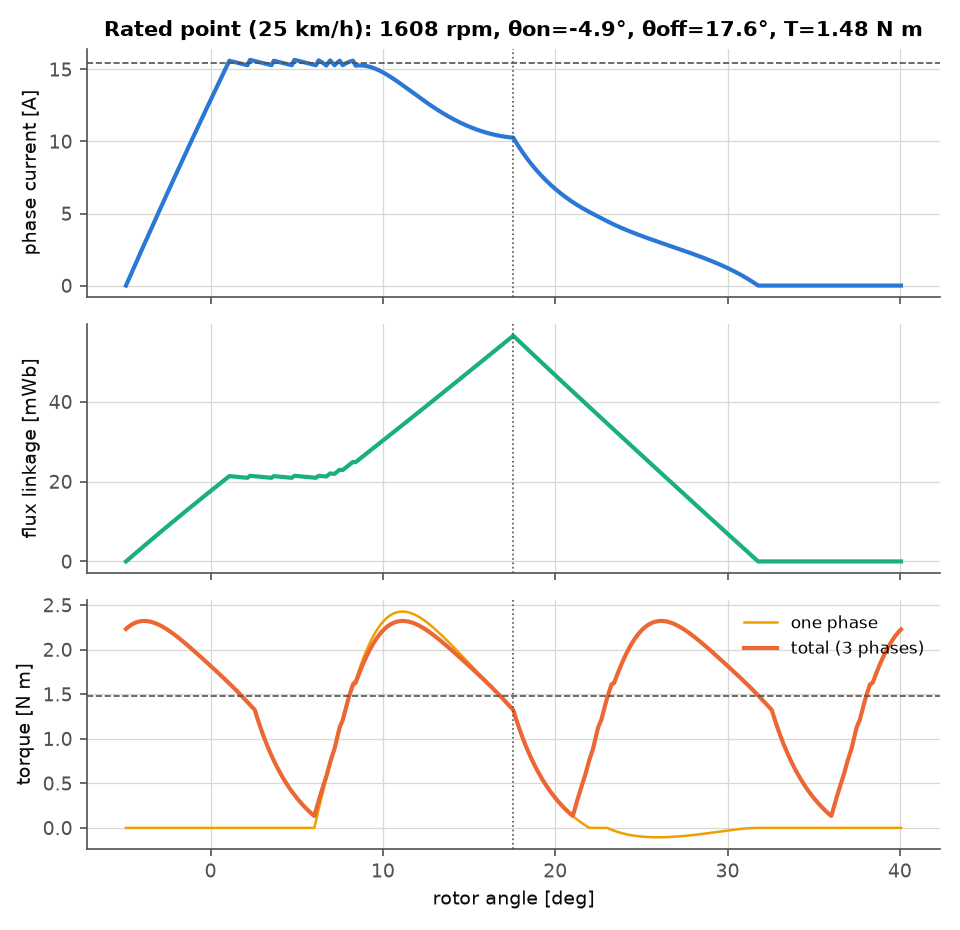
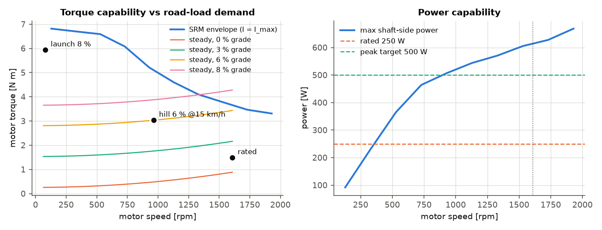
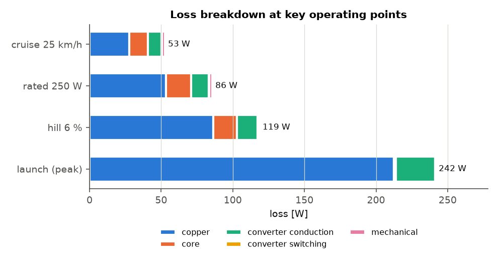
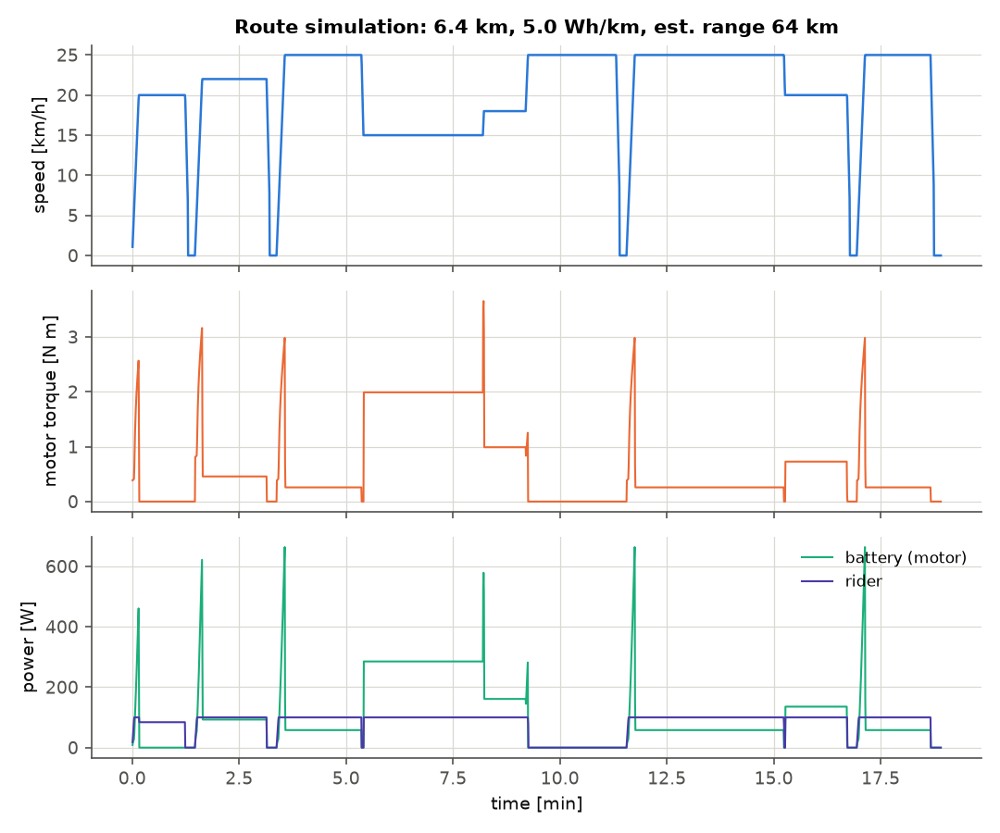

# Analysis and Design Considerations for a Switched Reluctance Motor-based Drive System for an Electric Bike

*Design study report. All numbers come from `python scripts/run_analysis.py`;
the full generated tables are in [`results/results.md`](../results/results.md).*

> **Revision note.** This report documents the analytical baseline. The FE-validated
> results in the IEEE manuscript ([`paper/main.pdf`](../paper/main.pdf)) supersede it.
> Those results come from `scripts/run_fea.py` and `scripts/run_revision.py` and are
> written to `results/fea/` and `results/revision/`. The 2-D FE model shows that the
> analytical flux-linkage model errs by up to 23 % in flux linkage and 17 % in mean
> torque (§ 12). The second revision (`scripts/run_revision2.py`, `results/revision2/`)
> adds battery-voltage/SOC sensitivity, iron-loss uncertainty, coupled three-phase FE checks,
> three standardized missions, a quantitative test of the corner-speed rule and an
> equal-envelope analytic surface-PM benchmark.

---

## Abstract

This report presents the analysis and design of a switched reluctance motor
(SRM) drive for a 250 W pedelec-class electric bicycle running on a 36 V
battery. The vehicle mission is translated into motor torque–speed
requirements. A 12/8 three-phase SRM is sized analytically from the output
equation, the Lawrenson pole-arc constraints and the volt-second balance. Its
behaviour is then evaluated with a nonlinear flux-linkage model coupled to a
time-domain model of an asymmetric half-bridge converter. Turn-on and turn-off
angles are optimised at each operating point. These results feed a torque–speed
envelope, an efficiency map, a loss breakdown, converter and thermal ratings,
and an energy simulation over a hilly urban route.

The baseline machine is Ø135 mm × 36 mm with 3.4 kg of active material and
drives the wheel through an 8 : 1 planetary gear. It meets the 5.9 N·m launch
torque (8 % grade, 0.5 m/s²) at 31 A phase current. With the analytical
magnetic model, the 250 W rated point reaches ≈ 81 % motor efficiency and
≈ 79 % battery-to-shaft efficiency, and the route consumes about 4.9 Wh/km with
100 W of rider input. The FE-based predictions in the paper are 80 % / 78 % and
5.1 Wh/km. A trade study shows that rated efficiency is governed mainly by
electric loading, i.e. by machine mass.

---

## 1. Why consider an SRM for an e-bike?

Most e-bikes today use a brushless PM (BLDC) hub motor. The SRM is worth
considering for several reasons:

| Aspect | SRM | PM BLDC hub |
|---|---|---|
| Rotor | Laminated steel only: no magnets, no windings | NdFeB magnets (rare-earth supply risk and cost) |
| Robustness | High temperature and overspeed tolerance; no demagnetisation | Magnets limit temperature (≈ 120–150 °C) |
| Fault behaviour | Phases are electrically and magnetically independent, so a faulted phase can be switched off. No drag torque when unpowered (free-wheeling is "free"). | Back-EMF can drive fault currents; cogging and short-circuit drag |
| Cost | Simple lamination stack and concentrated bobbin coils | Magnet cost dominates |
| Torque ripple and acoustic noise | **High**: needs control effort (TSF, current profiling) and mechanical damping | Low |
| Converter | Unipolar; asymmetric bridge needs 2 switches **and** 2 diodes per phase | Standard 6-switch inverter, widely available |
| Efficiency and torque density | Lower at this power level (magnetising current, large air-gap sensitivity) | Higher |

The "no drag when unpowered" property suits a pedelec particularly well: above
25 km/h, or with the battery empty, the rider pedals against bearings and gear
losses only. The two main design challenges this report addresses are torque
ripple and efficiency.

---

## 2. Vehicle mission and drive requirements

### 2.1 Road-load model

The tractive force at the tyre is

$$F = \underbrace{C_{rr} m g \cos\alpha}_{\text{rolling}} + \underbrace{m g \sin\alpha}_{\text{grade}} + \underbrace{\tfrac12 \rho C_d A v^2}_{\text{aero}} + \underbrace{k_m m a}_{\text{inertia}}$$

with m = 100 kg (80 kg rider + 20 kg bike), C_rr = 0.006, C_dA = 0.5 m², k_m = 1.05,
and a 26″ wheel (r = 0.33 m). Motor torque is T_m = F r / (G η_g) with gear ratio G
and gear efficiency η_g = 0.95.

### 2.2 Duty points

| Duty point | Condition | Motor torque (G = 8) |
|---|---|---|
| Cruise | flat, 25 km/h (149 W at the motor) | 0.88 N·m |
| Rated | 250 W continuous at 25 km/h | 1.48 N·m |
| Hill | 6 % grade at 15 km/h | 3.03 N·m |
| Launch (peak) | 8 % grade, 0.5 m/s², motor only | **5.93 N·m** |

The 25 km/h assist cut-off corresponds to **1608 rpm** at the motor (the base
speed). The drive is specified for 20 % overspeed (1930 rpm) on descents.

### 2.3 Corner-speed consideration

The most important early design decision is **the speed at which the turns
are chosen**. In an SRM, the flux-linkage swing a phase can reach in single-pulse
operation is fixed by the volt-seconds available,

$$\psi_{pk} = \frac{V_{dc}\,\theta_{dwell}}{\omega},$$

and the turns follow from ψ_pk = T_ph · B · A_pole. Below that speed the
torque at a given current is roughly ∝ ψ · i and is almost independent of
machine size. Choosing the turns for full torque at 25 km/h would demand
P = T_peak · ω_base ≈ 1 kW. That is twice what the battery, converter and
regulations need, and it would require about twice the phase current.

The launch torque is only needed at walking speed. The design therefore uses a
**corner speed** n_c = P_peak / T_peak = 500 W / 5.93 N·m ≈ **805 rpm**
(12.5 km/h). Constant torque is available below n_c and roughly constant power
above it. With this choice, the 31 A launch current is half of what a
base-speed design would need.

---

## 3. Topology selection

| Config | Phases | Stroke | Strokes/rev | f_ph at n_max | Switches (asym. bridge) |
|---|---|---|---|---|---|
| 6/4 | 3 | 30° | 12 | 129 Hz | 6 |
| 8/6 | 4 | 15° | 24 | 193 Hz | 8 |
| **12/8** | **3** | **15°** | **24** | **257 Hz** | **6** |
| 16/12 | 4 | 7.5° | 48 | 386 Hz | 8 |
| 24/16 | 3 | 7.5° | 48 | 514 Hz | 6 |

**12/8 selected** for these reasons:

* It has the same stroke count (smoothness) as 8/6 but needs only 6 switches,
  which lowers converter cost and gate-driver count.
* It has two pole pairs per phase. The radial forces are balanced, and the
  shorter flux paths allow a thin yoke, which suits the short-stack hub shape.
* Its phase frequency is 257 Hz at maximum speed, which keeps iron loss
  moderate with 0.35 mm laminations. The 16/12 and 24/16 options double this.
* A 3-phase machine with Lawrenson-compliant pole arcs self-starts in both
  directions. This matters for push-off on a hill and for walk-assist.
* 6/4 has a 30° stroke, which gives much larger torque dips and harder starting.

---

## 4. Machine design

### 4.1 Main dimensions: output equation

Krishnan's output equation, written in torque form, is

$$T = \frac{\pi}{4}\, k_e\, k_d\, k_2\, B\, A\, D^2 L,$$

with the following values: k_e = 0.85 (efficiency), k_d = 0.9 (conduction duty),
k_2 = 0.7 (= 1 − 1/λ_u), B = 1.7 T (aligned stator-pole flux density), and
A = 45 kA/m (short-term peak electric loading). Sizing for the 5.93 N·m peak
torque gives D²L ≈ 185 cm³.

For a hub, a pancake shape with L/D = 0.5 is chosen and the split ratio
D/D_o = 0.53. The result is:

| | |
|---|---|
| Outer diameter | 135.3 mm |
| Bore diameter | 71.7 mm |
| Stack length | 35.9 mm |
| Air gap | 0.30 mm (smallest that is practical with hub-bearing tolerances) |

The output equation is treated as a **starting point**. The required current
is then found by simulation (§ 6), because the analytical coefficients are
known to be optimistic for small, heavily saturated SRMs.

### 4.2 Pole arcs

The Lawrenson constraints are:

1. min(β_s, β_r) ≥ ε = 2π/(m N_r) = 15°, for self-starting from any position.
2. β_s ≤ β_r, which keeps more slot area and a wider unaligned gap.
3. β_s + β_r < 2π/N_r = 45°, so that a true unaligned (zero-overlap) zone
   exists. This keeps L_u low.

The chosen arcs are **β_s = 15°** and **β_r = 17°**. They sit near the
lower-left corner of the feasible triangle, which maximises the
inductance ratio and slot area. The 2° excess of β_r over β_s adds a short
dead zone before alignment, which gives the current time to decay before
negative torque begins.

### 4.3 Poles, yokes and turns

* Stator pole width w_s = 9.4 mm and rotor pole width w_r = 10.5 mm.
* Stator yoke y_s = 0.75 w_s = 7.0 mm. The pole flux splits in two, so
  y_s ≥ 0.5 w_s is the minimum. The margin limits yoke saturation and stiffens
  the yoke against ovalisation, which is the dominant SRM noise mode.
* Rotor pole height h_r = 9 mm (≈ 30 g). Deep rotor slots lower L_u, but taller
  poles are weaker mechanically. The remaining material forms a 19 mm rotor
  yoke around the 15 mm shaft.
* Turns: at the corner speed (805 rpm) and minimum battery voltage (30 V), with
  a one-stroke dwell, ψ_pk = 30 V · 15° / ω_c ≈ 93 mWb. With B = 1.7 T this
  gives **T_ph = 164 turns, i.e. 41 turns on each of the four poles of a phase**.

### 4.4 Winding

The concentrated bobbin coils fill 45 % of the slot (394 mm² per slot, two coil
sides). This gives a 1.66 mm wire, a mean turn length of 115 mm, and
**R_ph = 0.198 Ω at 100 °C**. The rated RMS current density is 4.4 A/mm², which
is acceptable for an enclosed hub with airflow from riding.

### 4.5 Inductances

* Aligned (unsaturated): L_a = 0.9 μ₀ (w_s + 2g) L T_ph² / (p g) ≈ **9.1 mH**,
  with a 10 % iron-MMF allowance.
* Unaligned: L_u ≈ **1.37 mH**. It is estimated from a centre path into the
  rotor slot in parallel with two side paths to the adjacent rotor-pole
  corners, plus 35 % for end-winding and leakage.
* Inductance ratio λ = L_a/L_u ≈ **6.6**, which is typical for small 12/8
  machines with this air gap.
* Saturated incremental inductance L_sat ≈ 1.1 L_u. The knee flux is
  ψ_k = 1.55 T · A_pole · T_ph ≈ 85 mWb.

---

## 5. Nonlinear magnetic model

The aligned magnetisation curve uses an exponential knee model:

$$\psi_a(i) = L_{sat} i + \psi_k\left(1 - e^{-(L_a-L_{sat})i/\psi_k}\right)$$

The unaligned curve is linear (ψ_u = L_u i). A position function w(θ) ∈ [0, 1]
blends the two:

$$\psi(i,\theta) = \psi_u(i) + w(\theta)\,[\psi_a(i) - \psi_u(i)]$$

w(θ) is a C¹ smooth step across the overlap region, widened by a fringing angle
of 2g/r. Because w multiplies a function of i only, the co-energy and torque
have closed forms:

$$T(i,\theta) = \frac{dw}{d\theta}\Big[W'_a(i) - \tfrac12 L_u i^2\Big]$$

The tests check this against a numerical derivative of the co-energy. The
static torque curves show the expected behaviour: torque is concentrated in the
overlap region, and it grows less than quadratically with current once the
poles saturate.

---

## 6. Power converter

### 6.1 Topology

The **asymmetric half bridge** (two MOSFETs and two diodes per phase) is
selected. It is the reference SRM converter and the only common topology that
offers all three voltage states (+V_dc, 0 and −V_dc) independently in each
phase. Those states give:

* fast magnetisation and demagnetisation, so more of the stroke produces positive torque;
* **soft chopping** (one switch on, freewheel at ≈ 0 V), which halves the
  current ripple, switching loss and acoustic noise compared with hard
  chopping;
* fault tolerance, because each phase is an independent H-leg.

The alternatives were rejected for these reasons:

| Topology | Switches | Reason rejected |
|---|---|---|
| (n+1)-switch / Miller | 4 | Shared switch prevents phase overlap at high speed and forces hard chopping |
| C-dump | 4 | Extra inductor and capacitor, plus dump-converter control |
| Split-DC | 3 | Needs an even phase count and balanced capacitor halves; halves the phase voltage |
| R-dump | 3 | Dissipative; slow demagnetisation |

### 6.2 Ratings

| | |
|---|---|
| Device voltage | ≥ 1.5 × 42 V = 63 V, so **100 V trench MOSFETs** are selected (≈ 4 mΩ) |
| Phase current limit | **30.7 A** (1.1 × the 27.9 A needed for launch torque) |
| Device RMS current (launch) | 19.4 A |
| Battery current (rated / launch) | 8.2 A / 8.5 A |
| DC-link ripple current (rated / launch) | 7.3 A / 15.9 A RMS |
| DC-link capacitance | 1–2.2 mF low-ESR, rated ≥ 14 A RMS (from battery/capacitor current-sharing analysis in the paper) |
| Average switching frequency | 1.7–3.8 kHz (hysteresis, 2 % band) |

The capacitor is chosen by **ripple current, not capacitance**. SRMs draw
unipolar current pulses, and during demagnetisation the energy returns to the
link. At launch, the stroke frequency is only about 32 Hz, so the battery
supplies most of the low-frequency ripple and the link ripple is set by the
battery impedance. A simple charge-balance bound would therefore greatly
oversize the bank.

The switching frequency of a hysteresis controller falls in the audible range.
A production design should use fixed-frequency PWM current control at
≥ 16 kHz with the same soft-chopping states. At 36 V this costs less than 2 W
of switching loss even at 20 kHz (paper, Table IX).

---

## 7. Control considerations

### 7.1 Operating modes

* **Current chopping (below ≈ 900 rpm).** Back-EMF is low, so the current is
  regulated to i_ref by soft chopping between θ_on and θ_off.
* **Single pulse (above).** The back-EMF exceeds V_dc before the current
  reaches the reference. Torque is then controlled by the angles alone:
  θ_on is advanced so that current builds up while the inductance is still
  low (L_u).

### 7.2 Angle optimisation

The turn-on advance is estimated from the time needed to build current in the
unaligned inductance:

$$\theta_{adv} \approx \omega L_u i_{ref} / V_{dc}$$

θ_on is then searched between the overlap angle and up to 1.6 × θ_adv before
it. θ_off is searched between 45 % and 95 % of the overlap-to-aligned interval.
Additional turn-on candidates are defined by the dwell, θ_off − d·τ_r with
d = 0.35–0.5. The dwell is capped at 55 % of the rotor pole pitch, which
maximises base-speed torque in a dwell sweep. Longer dwells push tail current
into the negative-torque region. At and above base speed, the optimum runs in
mild continuous conduction, with a pedestal of about 5 % of peak current.

At each operating point, the chopping reference is solved with Brent's method
for the target torque, and the angle pair with the lowest battery power is
kept. In a controller this becomes a 2-D look-up table θ_on, θ_off, i_ref = f(T*, ω).

### 7.3 Torque ripple

With β_s equal to the stroke angle, only one phase conducts for most of the
stroke. With the analytical model, the peak-to-peak torque ripple is
113–179 % of the mean across the operating range. The FE model predicts
60–100 %. The gear and wheel inertia filter much of this,
but on an e-bike it is felt as vibration and heard as noise. The mitigations
are, in order of cost:

1. **Torque-sharing functions (TSF)** that overlap incoming and outgoing phase
   currents. TSF is implemented in `srm_ebike/tsf.py`. With the FE model, cubic
   TSF reduces ripple to 10–33 % below 500 rpm, at the cost of 12–28 % more
   RMS current. It is infeasible above about 800 rpm at 36 V (paper, § VII).
2. A wider β_r, which gives more phase overlap but raises L_u.
3. Pole shaping (tapered or notched rotor poles).
4. Mechanically, a compliant gear coupling and a stiff, round stator yoke.

### 7.4 Position sensing

Commutation needs rotor position to about 1° mechanical. A low-cost option is
three Hall sensors with a magnetic target ring, which give 15° edges, combined
with speed-based interpolation. Sensorless schemes such as flux-linkage
observers or inductance probing in idle phases are attractive for sealed hubs,
but they must handle stand-still start-up on a hill.

---

## 8. Performance

### 8.1 Torque–speed capability

The envelope at the 30.7 A limit delivers about 6.8 N·m at low speed, and its
power exceeds the 500 W target well before 25 km/h.
All duty points of § 2.2 lie inside the envelope. A steady climb of 8 % at full
speed without pedalling lies outside it. That is acceptable, because a
pedelec rider contributes power on such a climb.

### 8.2 Efficiency

| Point | Speed | Torque | I_rms | η_motor | η_system |
|---|---|---|---|---|---|
| Launch | 80 rpm | 6.8 N·m | 19.4 A | 20 % | 18 % |
| Hill 6 % | 965 rpm | 3.0 N·m | 11.2 A | 76 % | 74 % |
| Rated 250 W | 1608 rpm | 1.48 N·m | 8.1 A | 81 % | 79 % |
| Cruise | 1608 rpm | 0.88 N·m | 5.6 A | 80 % | 77 % |

Copper loss dominates at every point. This is the classic SRM penalty: the
machine must carry its own magnetising current, and that current flows as
unipolar pulses with a high RMS-to-mean ratio. At the rated point, iron loss is
about 21 % of the total. Conduction loss in the MOSFETs and diodes is about
12 %, and it matters at only 36 V because of the diode drops.

### 8.3 Thermal check

At the continuous rated point the motor dissipates 55 W. The hub shell has
0.075 m² of surface and a lumped convection coefficient of h ≈ 25 W/m²K while
riding. This gives a temperature rise of about 29 K, or a winding hot spot of
about 65 °C at 30 °C ambient. The launch point (≈ 250 W of loss) is limited to
tens of seconds by the copper's thermal capacity, roughly 420 J/K. The paper
replaces this single-node estimate with a four-node transient network
(`srm_ebike/thermal.py`). That network shows that a *sustained* 6 % climb at
low airflow and 45 °C ambient approaches the class-F limit.

---

## 9. Route energy

The test route is 6.4 km of mixed urban and hilly riding with five stops, a
700 m climb at 6 % and a descent at 4 %. The rider supplies up to 100 W, with
force limited at low speed, and the motor supplies the rest below 25 km/h.
Braking is mechanical. The efficiency is interpolated from the map in § 8.2.

| | |
|---|---|
| Rider energy | 25.5 Wh |
| Motor shaft energy | 23.4 Wh |
| Battery energy | 31.5 Wh |
| Cycle-average drive efficiency | 74 % |
| **Consumption** | **4.92 Wh/km** (FE-based: 5.12 Wh/km) |
| **Estimated range** (90 % of a 36 V 10 Ah pack, model assumptions) | **≈ 66 km** (FE-based: ≈ 63 km) |
| Torque deficit | none |

---

## 10. Design trade study

| Gear | A_peak (kA/m) | D_o (mm) | L (mm) | Active mass (kg) | I_peak (A) | η_motor rated | η_sys rated |
|---|---|---|---|---|---|---|---|
| 5 | 60 | 144 | 38 | 4.1 | 27.7 | 75.0 % | 73.2 % |
| 5 | 45 | 158 | 42 | 5.5 | 29.2 | 81.7 % | 79.8 % |
| 5 | 35 | 172 | 46 | 7.1 | 31.2 | 84.2 % | 81.9 % |
| 8 | 60 | 123 | 33 | 2.5 | 29.3 | 76.9 % | 75.1 % |
| **8** | **45** | **135** | **36** | **3.4** | **30.7** | **80.9 %** | **78.8 %** |
| 8 | 35 | 147 | 39 | 4.4 | 32.0 | 82.7 % | 80.3 % |
| 11 | 60 | 111 | 29 | 1.8 | 30.3 | 77.4 % | 75.7 % |
| 11 | 45 | 122 | 32 | 2.4 | 31.6 | 79.8 % | 77.6 % |
| 11 | 35 | 132 | 35 | 3.2 | 33.7 | 80.9 % | 78.2 % |

The trade study leads to three observations:

* **The peak current is nearly independent of machine size** (28–34 A), as
  § 2.3 predicts. It is set by the volt-seconds and the torque requirement.
  Machine size mainly buys efficiency through lower copper loss.
* **Efficiency is set by electric loading, i.e. by mass.** For G = 8, going
  from 60 to 35 kA/m raises η_sys from 75 % to 80 % while mass grows from
  2.5 to 4.4 kg.
* **At similar mass, the gear ratio matters little.** The 8 : 1 / 45 kA/m
  baseline (3.4 kg, 78.8 %) and the 11 : 1 / 35 kA/m variant (3.2 kg, 78.2 %)
  are within a point. Choose the ratio on gear cost, noise and diameter.

**Recommendation:** use the 8 : 1 single-stage baseline for cost and
simplicity. Choose 11 : 1 when the smallest diameter matters. Raising the
efficiency further would need thinner laminations (0.2 mm), a smaller air gap
(0.25 mm) and fill factors above 0.5 (segmented stator with pre-wound coils).

---

## 11. Mechanical and acoustic considerations

* **Air gap.** At 0.3 mm the gap is small for a wheel hub that sees road
  shocks. The design needs a stiff shaft, preloaded bearings on both sides of
  the stack, and tolerance stack-up analysis. Every 0.05 mm of extra gap costs
  roughly 10 % of aligned inductance.
* **Radial forces.** The normal force on the aligned poles is many times the
  tangential force. The yoke thickness (0.75 w_s) and a round, press-fit
  housing raise the frequency of the ovalising mode above the strongest
  excitation (3 × f_ph).
* **Rotor.** The rotor is solid laminated steel with an inertia of
  4.1 × 10⁻⁴ kg·m², which is robust at overspeed. It can be sealed to IP65
  without any magnet-corrosion concern.
* **Free-wheeling.** No cogging or drag torque occurs when unpowered, so a
  freewheel clutch in the hub gear is optional rather than mandatory.

---

## 12. Modelling assumptions and limitations

* **FE validation (added in revision).** A nonlinear 2-D FE model
  (`srm_ebike/fea.py`) gives L_a = 8.56 mH and L_u = 1.52 mH (ratio 5.6
  instead of 6.6). The analytical model errs by up to 23 % in flux linkage and
  by 2–17 % in mean torque. Mutual coupling between phases is below 7 %. The
  paper's drive results use the FE tables (`srm_ebike/magnetics_fea.py`).

* The analytical flux-linkage model in this report estimates L_a, L_u and the
  knee from permeance models. Its FE-measured errors are listed above.
* The drive model neglects mutual coupling. FE puts its effect at ≤ 7 % in flux
  and torque during phase overlap.
* No prototype measurements exist yet. All numbers are model predictions.
* Iron loss is estimated from peak pole flux density with a non-sinusoidal
  factor of 1.3, not from the actual flux waveform in each region. Expect
  ±30 %.
* The converter uses ideal timing (no dead time or blanking) and a lumped
  switching-loss estimate. Switching loss is negligible at 36 V and a few kHz.
* The thermal model in this report is a single lumped node. The paper uses a four-node transient network.
* The route model is quasi-static. It has no regeneration and uses a constant
  rider power.

---

## References

1. R. Krishnan, *Switched Reluctance Motor Drives: Modeling, Simulation,
   Analysis, Design, and Applications*, CRC Press, 2001.
2. T. J. E. Miller, *Switched Reluctance Motors and their Control*, Magna
   Physics / Oxford, 1993.
3. P. J. Lawrenson et al., "Variable-speed switched reluctance motors,"
   *IEE Proc. B*, 127(4), 1980.
4. D. A. Torrey, J. H. Lang, "Modelling a nonlinear variable-reluctance motor
   drive," *IEE Proc. B*, 137(5), 1990.
5. V. P. Vujičić, "Minimization of torque ripple and copper losses in switched
   reluctance drive," *IEEE Trans. Power Electron.*, 27(1), 2012.
6. EN 15194:2017, *Cycles — Electrically power assisted cycles — EPAC bicycles*.
